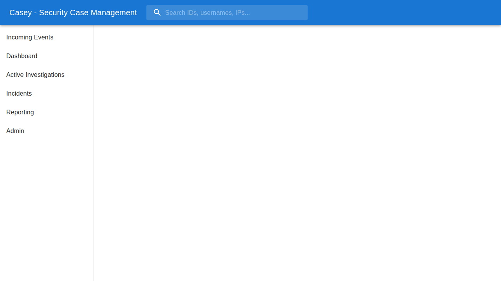

# Casey: Cybersecurity Case Management System

Casey is a modern, async-first Case Management System (CMS) designed for Security Operations Centers (SOC). It aggregates alerts, performs automated enrichment, and manages the incident lifecycle.


## Features

### 🚀 Async Enrichment Engine
*   **High Performance**: Powered by `asyncio` and Celery, Casey enriches events concurrently without blocking.
*   **Modular Plugins**: Easily extensible plugin architecture for integrations like CrowdStrike, Netskope, and more.
*   **Real-time Context**: Automatically queries SIEMs, Threat Intel, and EDRs as soon as an alert arrives.

### 🛡️ Production-Grade Security
*   **Secret Management**: Hybird secret handling using Environment Variables (Dev) and AWS Secrets Manager (Prod).
*   **Role-Based Access**: Granular permissions for analysts and admins.

### 🧩 Integrations
*   **CrowdStrike**: Process tree analysis and host containment.
*   **Netskope**: CASB/SWG risk scoring.
*   **Sumo Logic**: Log correlation.
*   **ProofPoint**: Email security analysis.

## Quick Start

1.  **Clone the Repo**
    ```bash
    git clone https://github.com/your-org/casey.git
    cd casey
    ```

2.  **Start Backend**
    ```bash
    cd backend
    pip install -r requirements.txt
    python manage.py migrate
    python manage.py runserver
    ```

3.  **Start Frontend**
    ```bash
    cd frontend
    npm install
    npm run dev
    ```

4.  **Run Workers**
    ```bash
    celery -A config worker --loglevel=info
    ```

## Architecture

See [ARCHITECTURE.md](docs/ARCHITECTURE.md) for a deep dive into the system design.

## Documentation

*   [Admin Guide](docs/ADMIN.md): How to configure secrets and add plugins.
*   [API Documentation](docs/API.md)


