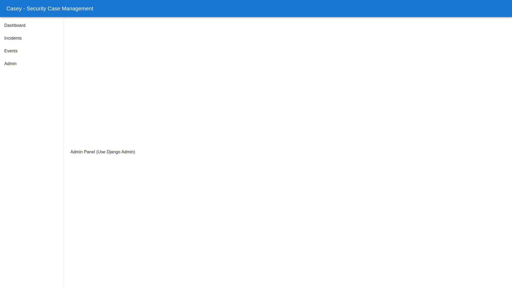

# Admin Guide

## Configuration
Casey is designed to be configurable. Key settings are managed via the Django Admin panel or Environment Variables.

### Environment Variables
*   `ONSPRING_API_URL`: URL for the OnSpring instance.
*   `SPLUNK_HOST`: Hostname for Splunk.
*   `CROWDSTRIKE_CLIENT_ID`: API Credentials.

### System Config (Database)
Dynamic settings can be changed in the Admin Panel under `Configuration > System Configs`.

*   `ONSPRING_SYNC_MODE`: Set to `POLLING` or `WEBHOOK`.

## User Management
Users are managed via Django Admin. Assign the `is_analyst` flag to give access to the Casey Dashboard.

