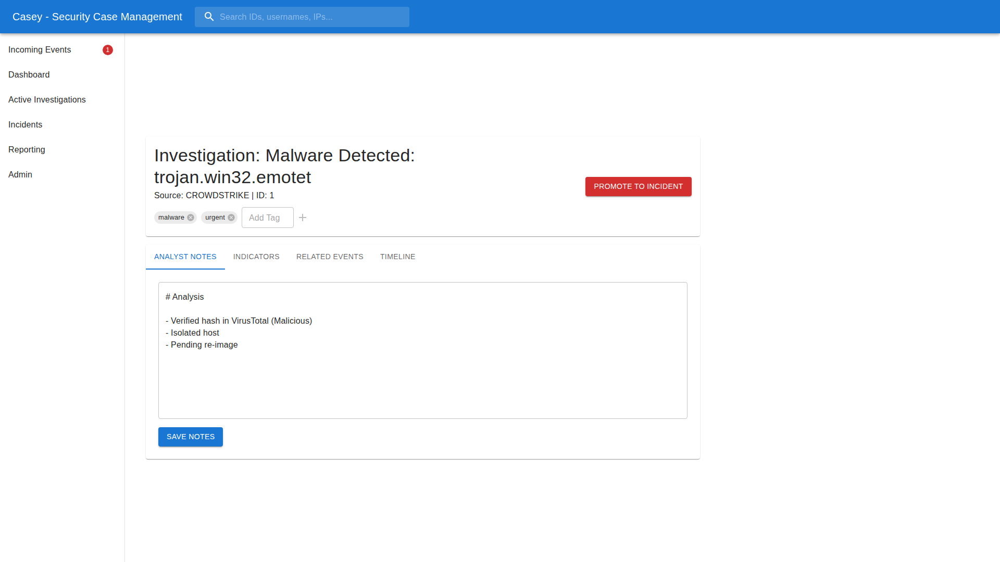
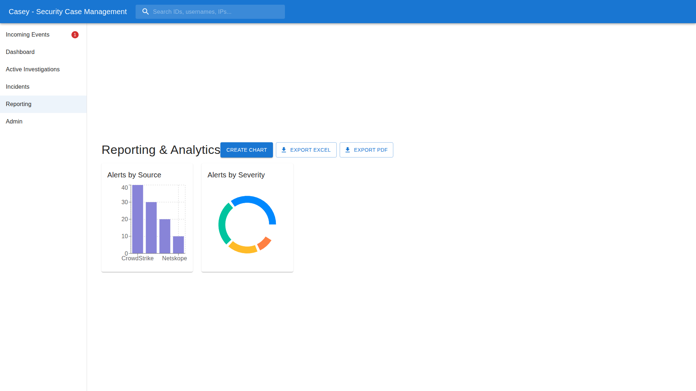

# User Guide

## Dashboard
The dashboard provides a high-level view of the security posture, including alert volumes by source and Mean Time To Detect (MTTD) metrics.

## Event Triage
Incoming alerts appear in the "Events" tab. Analysts should:
1.  **Review:** Examine the alert details.
2.  **Classify:** Use the status dropdown or bulk actions to mark events as:
    *   **False Positive:** Requires a reason (e.g., "Authorized Scan").
    *   **True Positive:** Automatically creates an **Active Investigation**.
    *   **Closed:** If no action is needed.

## Active Investigations
True Positive events move to the "Active Investigations" queue. This workspace allows analysts to:
*   Add markdown notes.
*   Manage indicators (exclude benign ones).
*   View related events.
*   See the timeline.

When enough evidence is gathered, click **"Promote to Incident"**.

## Incident Management
Promoted investigations become Incidents. This triggers:
1.  **OnSpring Sync:** The incident is pushed to the GRC platform.
2.  **War Room:** Analysts can click "Start War Room" to generate a WebEx link.

## Reporting
The Reporting module allows creating custom charts and exporting data to PDF or Excel.

