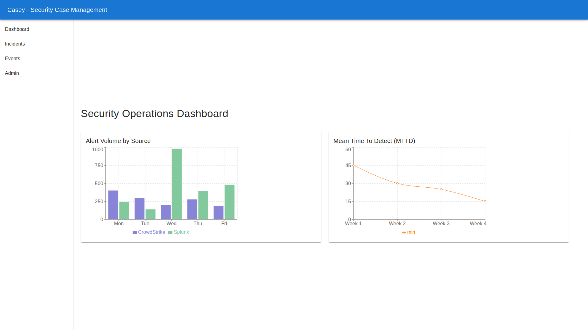
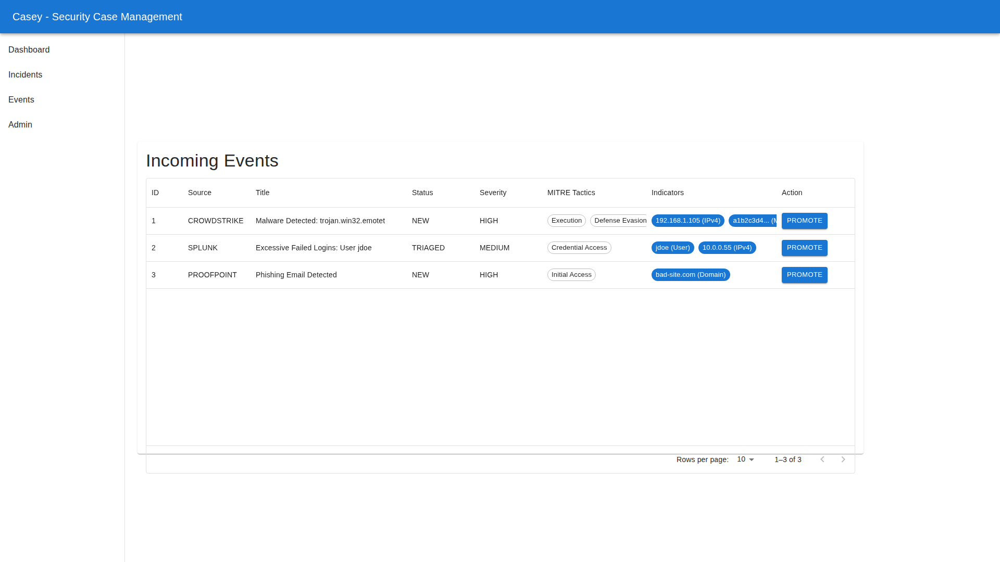
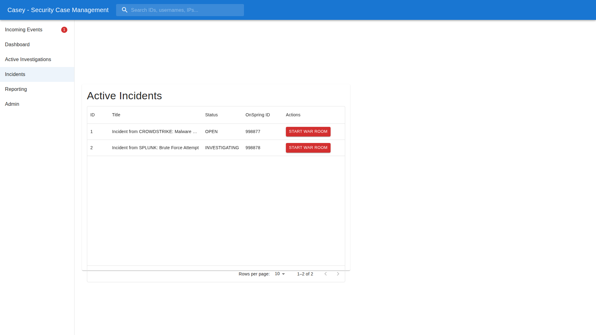

# User Guide

## Dashboard
The dashboard provides a high-level view of the security posture, including alert volumes by source and Mean Time To Detect (MTTD) metrics.

## Event Triage
Incoming alerts appear in the "Events" tab. Analysts can review the raw data and "Promote" confirmed threats to Incidents.

## Incident Management
Promoted events become Incidents. This triggers:
1.  **OnSpring Sync:** The incident is pushed to the GRC platform.
2.  **War Room:** Analysts can click "Start War Room" to generate a WebEx link.

